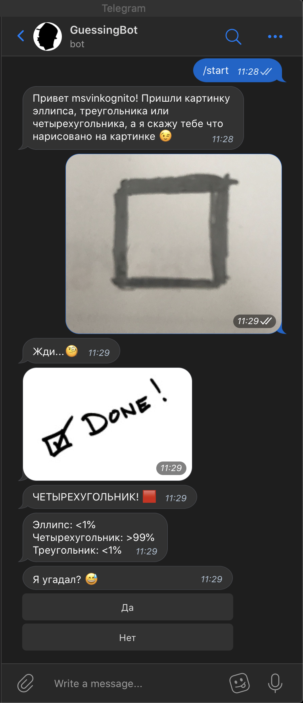
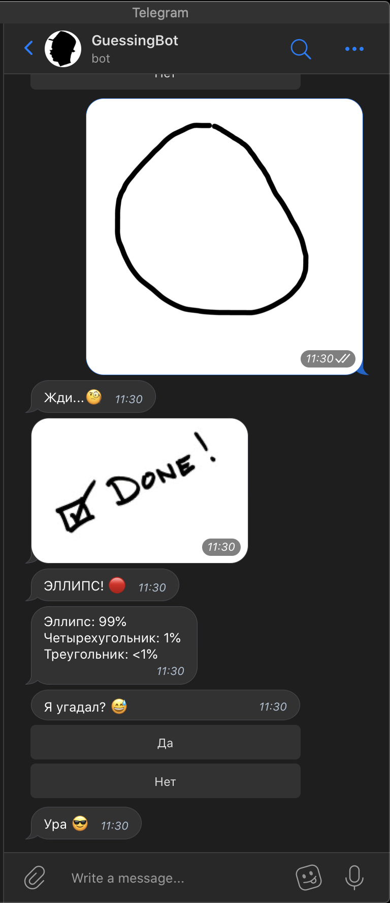
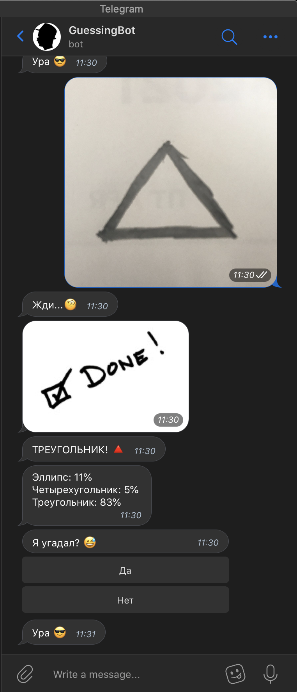

# GuessingBot

DOESN"T WORK ANY MORE

Bot that can guess three basic shapes (ellipse, triangle, rectangle)

Usage:
0 - pip install -r requirments.txt

1 - paste your telegram bot token in token.txt

2 - 'python3 DataSetBuilder gen' - to generate training images (without 'gen' to just add pics from new-data directory to training images).
Pics appear in new-data directory when bot was wrong. So that next time he get it right.

3 - 'python3 cnn.py' to train your neural network. Model will be saved as drawing_classification.h5

4 - 'python3 TelegramBot.py' - your bot is up and running. You can interact with it through telegram

5 - don't modify files e.txt, r.txt, t.txt

